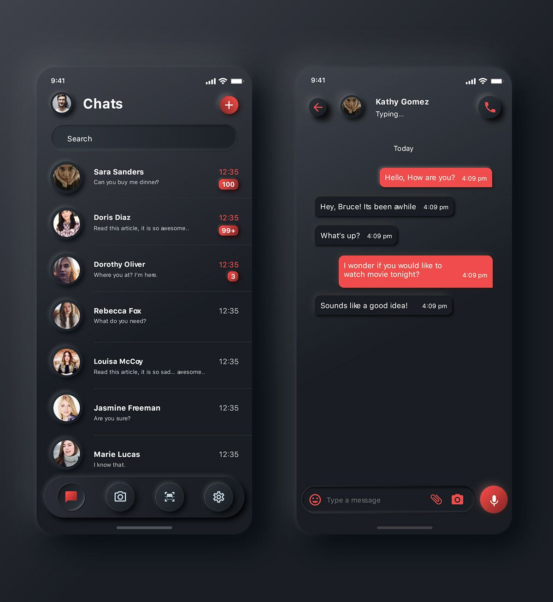
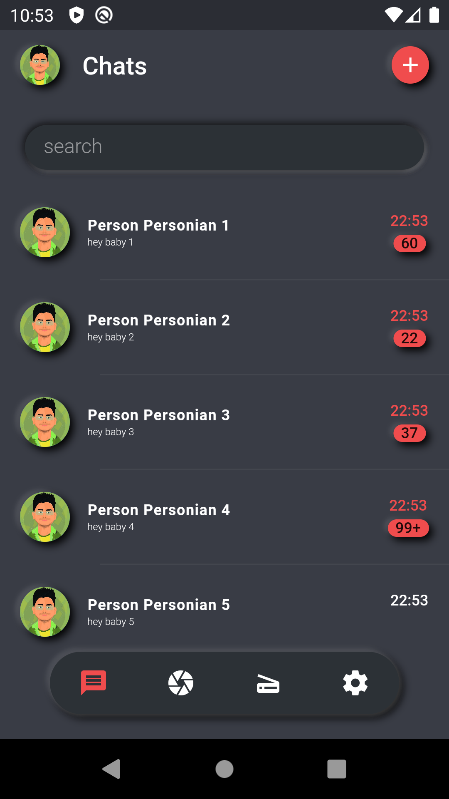

# chat_ui

A Flutter app to create chat design from pintrest.

## What's the design?

## Where are we now?
Currently we craeted first page of (list of chats) with a DUMMY_LIST and random number of messages. but it can be synced with API.

### refrences
- Link to [Pinterest](https://www.pinterest.com/pin/4785143343926955/)
